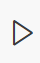

# Habit Tracker

#### Nikol Pavlova 

## Overview

This Python project is an OOP (Object-Oriented Programming) application, used to track and analyze personal habits. It gives the ability to users to add, analyze, delete as well as store habits into the system between different sessions. 


## Introduction


Python Version: The project was programmed using Python __3.12.1__.  

* Earlier versions may also work but 3.12.1 or newer is recommended.  


### Requirements:

This project uses only Python's built-in libraries.  

Before cloning the repository make sure that Git is installed on your system:  

[https://git-scm.com/downloads](https://git-scm.com/downloads)


## Installation


1. After ensuring that Git is installed clone the repository from GitHub:


    ```bash

    git clone https://github.com/nikolpavlova/habit_tracker_project.git

    ```


2. Find the project folder:


    ```bash

    cd habit_tracker_project

    ```


3. Run the main Python script using the command:


    ```bash

    python main.py

    ```


Click on this button in the right corner:





## Usage

### Features

Here are some of the most important features of the program:

* Adding and deleting a habit. 

* Checking off a habit. The user checks off a habit when they complete the habit for the day, in this way, they track their progress. The check-off function is strict (it only counts a habit as completed if done for the full day/week as specified).

* Calculating the streak of a habit for either daily or weekly habits. In this way it motivates the user to continue checking off the habit. That is the whole purpose of the program: to follow the user's progress and by analyzing data, encourage the user to develop healthy habits.

* Analysis of the habits. The user can ask to see all the habits, to measure previous streak history, to calculate longest streak overall and to examine the habits based on periodicity.

### Menu

The menu is pretty self-explanatory, it has the following layout:

1. Add a new habit

2. Check off a habit

3. Calculate streaks

4. Delete a habit

5. Analyze your habits

6. Exit


For each feature the user should press a number.

For example:

(If the user wants to add a weekly habit called pilates.)

```

Your choice: 1

Habit name: pilates

Periodicity (daily/weekly): weekly

```

#### Analytics menu

```

📊 Analytics Menu

1. List all habits

2. Habits by periodicity

3. Longest streak overall

4. Longest streak for a habit

5. Exit Analytics Menu

Choose an option: 

```


### Tests

For the test paste this command into the terminal and run the command:

```

python -m unittest tests/tests.py

```

The tests covers habit creation, check off reliability, streak calculation, and analytics functionality.


### Predefined habits

The system comes with predefined habits that can be found in the habits.json file as well as in the habit_names.py file.

```

Currently tracked habits:

- coding

- working

- running

- dentist visit

- reading

- weekly planning

- eating healthy

```

Their progress simulates an actual user's past history data and they can be analyzed the exact same way as the newly added habits by the user. 


## Structure

The structure of the program is the following:

```bash

habit_tracker_project/
.
├── analytics/
│   └── analytics.py
├── db/
│   ├── habit_names.py
│   ├── habits.json
│   └── storage_saver.py
├── models/
│   └── habit.py
├── tests/
│   └── tests.py
├── image-1.png
├── main.py
└── README.md

## Documentation

The program's files are documented with docstrings and comments. 


## Errors

The habit tracker has some limitations. For example, when the user adds a new habit and they want the habit to be checked off, the habit appears into the json and the habit_names.py file however if the user want in the same session to press "5. Analyze your habits" and then press "1. List all habits", then the program prints the list of the previous habits without the newly printed habit. However, if the user adds the habit, then enters "6. Exit", and then runs the program again and asks for the list of all habits, the program returns them with the newly saved habit. This could cause confusion but the problem is easily solved after exiting the program and running it again.